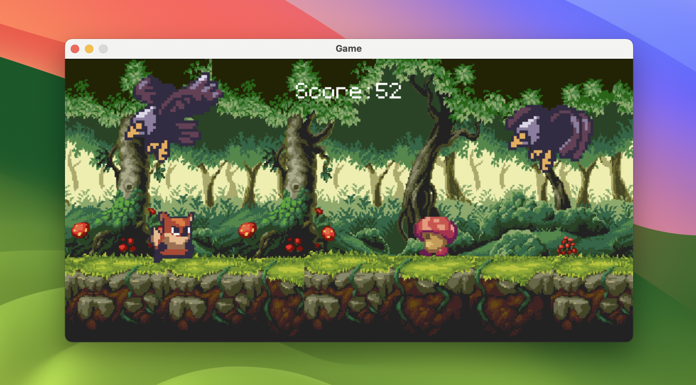

# Forest Runner

Repository of a game inspired by Clear Code tutorial Pygame Tutorial





## Run Locally

Clone the project

```bash
  git clone https://https://github.com/isaac-evs/Pygame_Tutorial.git
```

Go to the project directory

```bash
  cd Pygame_Tutorial
```

Install dependencies

```bash
  pip3 install pygame 
```

Run the game

```bash
  python3 main.py
```


## Acknowledgements

 - [Clear Code](https://www.youtube.com/watch?v=AY9MnQ4x3zk&list=LL&index=1&t=8s)
 - [ansimuz](https://ansimuz.itch.io/sunny-land-pixel-game-art)
 - [SUNO](https://suno.com)
